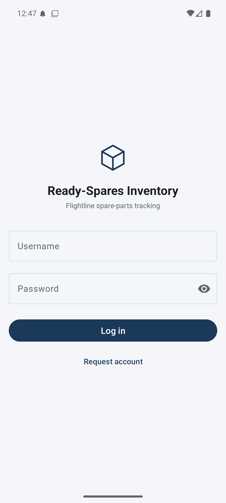
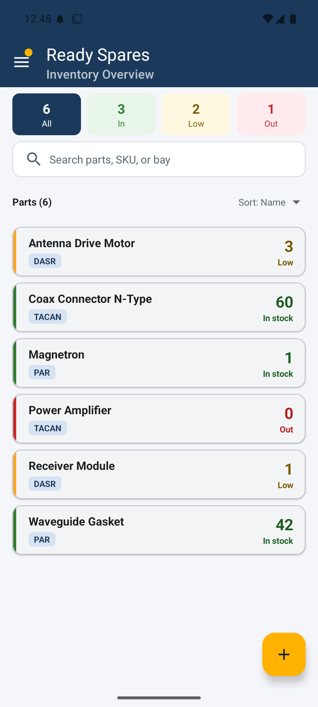
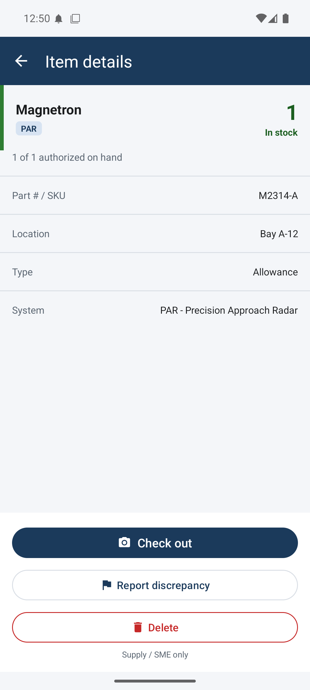
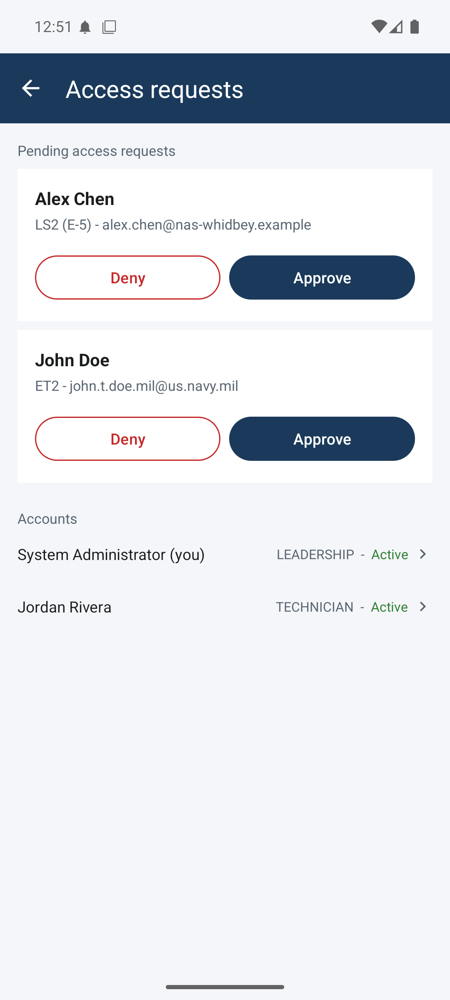
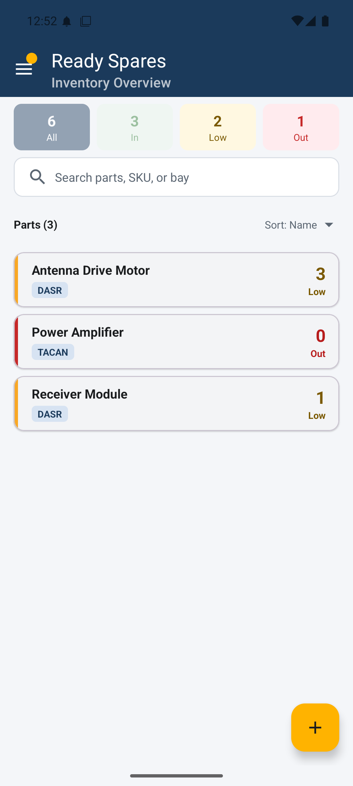

# Ready-Spares Inventory

**Android spare-parts tracking for a Naval Air Station Ground Electronics Maintenance Division scenario.**


-blue)


Ready-Spares Inventory is an Android app for tracking ready-spare parts at a Naval Air Station's Ground Electronics Maintenance Division (GEMD): the shop that keeps the airfield's safety of flight systems mission-ready. It's set at NAS Whidbey Island, and it replaces manual tracking that's slow and easy to get wrong. Technicians scan a part to check it out, with a forced scan-to-verify so the wrong part can't leave the shelf. Supply scans in new stock and manages inventory; Leadership gets low-stock alerts and controls accounts.

> **Project status: complete.** It runs end to end on an emulator and/or a physical device.

---

## Download & install (Android)

Ready-Spares runs on Android 9.0 or newer. It isn't on the Play Store, so you install the APK directly.

1. On your phone, open the [latest release](https://github.com/GoudyMT/CS-360-Mobile-Architect-Programming/releases/latest) and download the APK (or scan the code below).
2. Tap the downloaded file to install. If Android asks, allow installs from your browser or files app this once.
3. Open Ready-Spares and sign in with one of the seeded logins in the [demo](#demo-scan-to-verify-checkout) below.

**Scan to download:**


It's a sideloaded portfolio build, so Android will warn that it's from an unknown developer. That's normal for an APK that doesn't come through the Play Store.

---

## Why it exists

GEMD keeps the safety of flight systems that let pilots and controllers keep the airfield open. When one drops for a part and the ready-spare isn't on the shelf (or the wrong part gets pulled), it stays down until the part shows up. Manual spare tracking is slow and easy to get wrong. Ready-Spares targets three needs:

- **Speed and accuracy for technicians** - big touch targets, barcode scanning, and a forced scan-to-confirm so the right part leaves the shelf.
- **Receiving and stock control for supply/logistics** - scan in new stock, manage inventory, remove obsolete parts.
- **Visibility for leadership** - automatic alerts when a part runs low, plus account control for the shop.

This is an academic scenario (see [Academic context](#academic-context)).

---

## Demo: scan-to-verify checkout

The core safety feature is the checkout, and it doesn't just take your tap for it. You scan the part, and the app checks that scanned SKU against the item on screen. If it matches, you move on to entering the job number. Scan the wrong part and the phone buzzes and won't check it out.

To try it: open the **Magnetron (M2314-A)** part, tap **Check out**, and scan one of these with the in-app camera (or any phone camera):

| Scan this | Encodes | Result |
|---|---|---|
|  | `M2314-A` | **Match** - it's the part on screen, so checkout continues to the job number. |
|  | `RX-4471` | **Wrong part** - that code is a different item (Receiver Module), so the app rejects it and the phone buzzes. |

These are standard QR codes, readable by the in-app ZXing scanner and by a normal phone camera. The same lookup drives receiving: a known SKU jumps to a receive-quantity prompt, and an unknown one opens a pre-filled "new part" form.

**Seeded logins for a quick look (local only):**

- Leadership: `admin` / `flightline`
- Technician: `jordan.rivera` / `Flightline1` (forces a password change on first login)

---

## Features

- **Role-aware access** - Technician, Supply/SME, and Leadership roles drive what each user sees and can do. Restricted actions are hidden from lower roles and re-checked on entry, so a technician can't reach receiving, oversight, or account controls.
- **Scan-to-verify checkout** - checkout re-scans the part and confirms the SKU before it commits; a wrong part triggers haptic feedback and is refused, with a manual-entry fallback if the camera can't read the code.
- **Barcode receiving** - scan a part to add stock; a near-match guard catches typos, and an unknown SKU opens a pre-filled "new part" form.
- **Inventory dashboard** - searchable, color-coded stock grid with status quick-filters and a combined "Low & Out" view.
- **Account lifecycle** - users request access; Leadership approves from an in-app queue (auto-generated `firstname.lastname` username, temporary password, forced first-login change) and manages existing accounts: enable/disable, change role, and reset password, with last-admin and self-protection guards.
- **Low-stock alerts** - a daily background sweep (WorkManager, 0800 local) sends an SMS to supply/leadership and posts an on-device notification that deep-links into the Low & Out view.
- **Auditable checkout** - each checkout writes an audit record (who took what, and why) atomically with the stock change, guarded by optimistic concurrency so two people can't both take the last one.
- **On-device data** - everything persists locally with Room and survives restarts; no network or account server required.

---

## Screens

<table>
  <tr>
    <td align="center"><br><sub><b>Login</b></sub></td>
    <td align="center"><br><sub><b>Inventory grid</b></sub></td>
    <td align="center"><br><sub><b>Item Details</b></sub></td>
  </tr>
  <tr>
    <td align="center"><br><sub><b>Account admin</b></sub></td>
    <td align="center"><br><sub><b>Low &amp; Out</b></sub></td>
    <td></td>
  </tr>
</table>

| Screen | Purpose |
|---|---|
| **Login / Request Account / Change Password** | Role-based sign-in, access requests, and the forced first-login password change. |
| **Inventory Grid** | Search, color-coded stock, status quick-filters, the Low & Out view, and the role-aware nav drawer. |
| **Scanner (Receive)** | Live camera decode, flashlight toggle, manual-search fallback, near-match guard, and receive-quantity prompt. |
| **New Part** | Add-item form, pre-filled with a scanned but unknown SKU. |
| **Item Details** | Full part detail and the scan-verified checkout (the camera opens in place). |
| **Account Admin** | Leadership approval queue plus existing-account management. |
| **Notifications / Settings** | SMS opt-in and alert toggles; camera and SMS status. |

---

## Tech stack

- **Language:** Java
- **Platform:** Android (minSdk 28 / targetSdk 36 / compileSdk 36); runs on Android 9.0+
- **Persistence:** Room (SQLite)
- **UI:** Material Components, RecyclerView, navigation drawer, edge-to-edge with WindowInsets
- **Lifecycle / state:** Lifecycle ViewModel + LiveData
- **Background work:** WorkManager (daily low-stock sweep + notification)
- **Barcode:** ZXing (embedded)
- **Build:** Gradle (Kotlin DSL)

---

## Architecture (at a glance)

- **One Activity per screen**, thin and single-purpose: login/registration, inventory grid, scanner, new part, item details, account admin, notifications, settings.
- **MVVM data flow** - `Activity -> ViewModel + LiveData -> Repository -> Room DAO -> SQLite`. Repositories keep database logic out of the Activities.
- **Room** persists four tables - users, inventory, systems, and an append-only audit log.
- **Role enforcement** happens two ways: controls are hidden per role, and each restricted screen re-checks the signed-in role on entry, so hiding isn't the only guard.
- **Atomic checkout** - the quantity decrement and the audit-log write happen in one transaction, and an optimistic `version` guard means the first checkout wins while a stale one gets a "stock changed" error.
- **ViewModels** preserve state across rotation; the grid is reactive, so it updates itself as the database changes.
- **WorkManager** runs the low-stock sweep in the background at 0800 local, independent of the UI.
- **Delivery seam** - SMS and notifications sit behind a small `Notifier` interface (on-device today; a server implementation for real email/push is the marked extension point).

> The full data model and design rationale live in the app's original design docs, which aren't published in this repository.

---

## Build from source

**Prerequisites**
- Android Studio (latest stable) with **Android SDK Platform 36** installed
- The JDK bundled with Android Studio is sufficient
- An emulator (e.g., Pixel 6, API 36) or a physical device on **Android 9.0+ (API 28+)**

**Run it**
```bash
git clone https://github.com/GoudyMT/CS-360-Mobile-Architect-Programming.git
cd CS-360-Mobile-Architect-Programming
```
1. Open the project in Android Studio and let Gradle sync.
2. Select a device or emulator running API 28+.
3. Run the app (`Shift+F10`) and sign in with one of the seeded logins above.

**Permissions:** the app requests `CAMERA` (scanning), `SEND_SMS` (low-stock alerts), and `POST_NOTIFICATIONS` (the on-device alert) at runtime. Declining any of them leaves the rest of the app fully functional.

---

## Roles & permissions

| Capability | Technician | Supply / SME | Leadership |
|---|:---:|:---:|:---:|
| View + search inventory, check out (with scan verify) | Yes | Yes | Yes |
| Receive / add / edit / delete parts | - | Yes | Yes |
| Low-stock alerts + Low & Out view | - | Yes | Yes |
| Approve requests, manage accounts, change roles | - | - | Yes |

---

## Academic context

I built Ready-Spares as the term project for **CS-360**, a mobile application development course. I started with a user-centered UI design and built it into a working app. It persists data, handles runtime permissions, runs background work, and enforces role-based access. I also wrote a launch plan for taking it to release. It's a course exercise, not a real or deployed Navy system.

---

## Author

**Max Goudy** - US Navy veteran and computer science student. Built solo.

For usage or licensing inquiries, reach out through this repository.

---

## License

Copyright (c) 2026 Max Goudy. All rights reserved.

Published for portfolio and evaluation purposes. No permission is granted to copy, modify, distribute, or reuse this software or its source, in whole or in part, without the author's express written permission. See [`LICENSE`](LICENSE).
